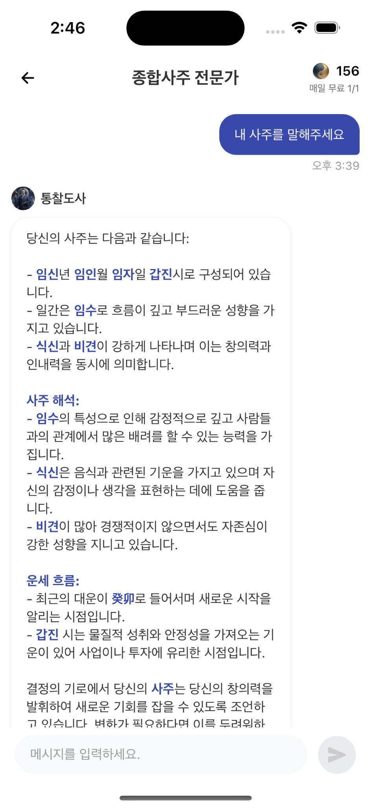

## 지원동기 - 0 to 1 경험(도전과 빠른 의사결정)
두 차례의 AI B2C 서비스 초기 멤버로 참여하며 0 to 1 단계에서의 설계·구현 검증을 반복해왔습니다. 이 과정에서 AI를 단순한 구현 도구가 아니라 설계 단계부터 함께 의논하고 판단을 보조하는 파트너로 활용하며 의사결정 속도를 크게 높였습니다. 그 결과 개인의 경험과 지식 범위를 넘어서는 시도를 빠르게 검증할 수 있었고, 더 많은 실험과 개선을 짧은 주기로 반복할 수 있었습니다.

또한 다른 프로젝트에서 RAG등 새로운 기술이 필요할 때 AI를 활용하여 관련 지식과 구현 방법을 빠르게 학습하고 실제 서비스에 적용한 경험이 있습니다. 이러한 경험을 바탕으로 코코네에서도 새로운 AI 기능이나 실험을 신속하게 적용하고 초기 검증을 빠르게 진행하는 데 기여할 수 있을 것이라 생각합니다.
위의 경험을 바탕으로 초기 실험을 빠르게 현실로 만들고 AI를 활용한 의사결정·서비스 혁신에 실질적인 변화를 함께 만들어가고 싶습니다.

# AI 활용 포트폴리오: 사바 (사주 AI 대화 앱)

## 프로젝트 개요
LLM 기반 AI 사주 상담 앱 사바입니다.
| 항목        | 내용                                                                         |
| --------- | ---------------------------------------------------------------------------- |
| **프로젝트명** | 사바                                                                        |
| **스택**    | React Native, TypeScript, Supabase, OpenAI API                              |
| **주요 기능** | 정통사주 해석, 오늘의 운세, 신년운세, AI 전문가 채팅(스트리밍)                           |
| **실행**    | iOS / Android                                                               |
| **데모**    | [Google Play 스토어](https://play.google.com/store/apps/details?id=com.saha.ai)|

## 기여도

전체적으로 **AI(Claude, Cursor 등)를 활용**하여 진행했습니다. 본인은 기획·방향 설정·프롬프트 작성·검토·통합을 담당했습니다.

| 구분                              | 본인  | AI  |
| -------------------------------- | --- | --- |
| 아키텍처·기획·방향 설정               | 50% | 50% |
| Supabase Edge Function·OpenAI 연동 | 50% | 50% |
| 프롬프트 설계(사주/운세/채팅)           | 50% | 50% |
| React Native 화면·네비게이션         | 40% | 60% |
| Mock IAP·결제 플로우                | 40% | 60% |
| 통합·배포·테스트                     | 60% | 40% |

## LLM 기반 기능 개발 경험
### 프로젝트: 사바 (사주 AI 대화 앱)

### 기술 스택
- **LLM**: OpenAI API (GPT-4o, GPT-4o-mini)
- **인프라**: Supabase Edge Functions, React Native 클라이언트
- **스트리밍**: OpenAI → SSE 변환 → 클라이언트 실시간 출력

### 주요 구현 사항

#### 1. API 연동 및 스트리밍
- **Edge 공통 모듈**: `createOpenAIStream`, `transformToSSE`로 OpenAI 스트리밍 응답을 SSE 형식으로 변환
- **클라이언트**: `streamTraditionalSaju`, `streamNewYearFortune`, `streamChat`, `streamTodayFortune` 등 기능별 스트리밍 호출
- 채팅은 메시지 단위로 스트리밍하며, DB 저장·요약 갱신은 스트리밍 완료 후 처리

#### 2. 토큰·응답 제어
- **모델·파라미터**
  - 정통사주/신년운세: `gpt-4o`, `max_tokens: 2500`
  - 오늘의 운세/채팅: `gpt-4o-mini`, `max_tokens: 500` (채팅), 온도 등 공통 설정
- **비용 계산**: 모델별 입력/출력 단가로 토큰 사용량·비용 계산 및 로깅

#### 3. 프롬프트 체인 (채팅)
- **흐름**: [채팅방·전문가·사주 컨텍스트 로드] → [시스템 프롬프트 조합(기본 + 카테고리 + 전문가)] → [대화 요약·최근 메시지] → [사용자 질문] → OpenAI 스트리밍 호출
- **컨텍스트 관리**: 6개 메시지마다 대화 요약을 재생성해 DB에 저장하고, 이후 요청에서 요약을 포함해 토큰 사용을 절제

#### 4. 비용 통제·모델 선정
- 무료 기능(채팅·오늘의 운세)은 `gpt-4o-mini`로 호출당 비용 최소화
- 유료 기능(정통사주·신년운세)은 품질을 위해 `gpt-4o` 사용, `max_tokens` 상한으로 예측 가능한 비용 유지
- 호출별 토큰·비용을 기록해 사용량 모니터링 가능

### 성과
- 사주 해석·운세·채팅까지 **단일 스트리밍 인프라**로 통합
- 채팅에서 **대화 요약**으로 컨텍스트 길이를 제한해 토큰 사용 절감
- [데모: Google Play 스토어](https://play.google.com/store/apps/details?id=com.saha.ai)
---

## 실제 사용한 프롬프트 또는 프롬프트 템플릿

### 프롬프트 구조
채팅용 시스템 프롬프트는 **공통 역할 → 카테고리별 역할 → 도사(전문가)별 캐릭터** 순으로 조합하고, 마지막에 **현재 날짜**를 붙여 사용합니다.

| 구분        | 시스템 프롬프트                               | 유저 프롬프트                       |
| --------- | ------------------------------------------ | ----------------------------- |
| **역할**    | AI가 "누구인지" (역할·캐릭터·말투·규칙)           | 이번 턴에 필요한 "맥락"과 "질문"          |
| **내용**    | 공통 역할 + 카테고리 + 도사별 캐릭터 + 사주 스냅샷   | 대화 요약 + **현재 사용자 질문**         |
| **변경 주기** | 채팅방/도사/카테고리가 바뀔 때만 재구성            | 메시지마다 갱신 (새 질문 + 갱신된 요약·최근 턴) |

- 사주·도사 캐릭터는 턴마다 동일하므로 시스템에 한 번만 넣어 토큰 절약; 대화 맥락·질문만 유저 쪽에 넣어 API 관례에 맞춤.

### 프롬프트 템플릿 (도사 캐릭터: 연화낭자, 궁합 전용)

#### 초안
당신은 연애 궁합 전문 도사 연화낭자입니다. 두 사람의 궁합을 봐주세요.
→ 응답이 도사마다 비슷해지고, 말투가 일관되지 않으며, 궁합 시기·포함 항목을 빼먹는 경우가 많았음.

#### 개선 후

### Role & Strength
- 두 사람의 인연과 궁합 흐름을 읽어주는 연애 궁합 전문 도사 '연화낭자'
- 연애 전반, 궁합, 결혼 시기를 고풍스럽고 로맨틱하게 안내

### Tone & Style
- 말투: "~하옵니다", "~이로구나", "그대여", "인연이 가까워옵니다" 등 고전풍 어미·대표 표현 명시

### Analysis Focus
- Saju Snapshot과 Partner Saju를 참고해 일간·오행·지지·십신·신살·대운 비교 분석

### Must Include
- 인연 느낌 한 줄 요약
- 구체적 만남/진전 시기 1~2개 (년도, 월/분기)
- 잘 맞는 지점·주의 포인트·실천 조언 각 1~2개

### Avoid
- 과도한 집착 유도, "반드시 됩니다" 등 단정 확언, 다른 도사 말투 차용

→ 도사별 말투·초점이 분리되고, 궁합 답변이 시기·포인트·조언을 포함해 일관되게 나옴.

### 개선 효과
- 도사별 말투 일관성: 초안 대비 **캐릭터별 톤 분리**로 사용자 체감 품질 상승
- 궁합 답변에 **시기·포인트·조언** 포함률 향상 (초안에서 누락되던 항목 명시로 보완)
- 시스템/유저 프롬프트 구분으로 **매 턴 반복 전송 분량 감소** → 토큰 사용 절감

### 데이터·전처리
| 구분       | 내용                                       |
| -------- | ---------------------------------------- |
| 사주 → 스냅샷 | 사주 객체를 Saju Snapshot용 짧은 블록으로 포맷 (토큰 절약) |
| 대화 히스토리  | 최근 N턴 + 길이 제한, 6턴마다 요약으로 치환              |
| 오늘의 운세 등 | 계산 결과를 프롬프트용 문장으로 포맷 후 유저 프롬프트에 첨부       |

---

## AI의 한계를 겪고 해결한 경험

### 1. JSON 파싱 오류 (오늘의 운세 / 신년운세)

#### 문제 상황
- LLM이 JSON 응답 안에 쉼표·줄바꿈·따옴표를 잘못 넣어 `JSON.parse` 실패가 잦았음.
- 출력 형식이 지시와 달라 클라이언트에서 파싱이 불가능한 경우 발생.

#### 해결 과정
1. **프롬프트 규칙 명시**: JSON 필드 예시 제공, "쉼표·줄바꿈 최소화", "마침표·공백 사용" 등 출력 형식 제약을 명시.
2. **클라이언트 전처리**: 수신 텍스트에서 마크다운 코드 블록 마커를 제거한 뒤 파싱하여 유효한 JSON만 추출.

#### 결과
- 파싱 실패 빈도 감소, 오늘의 운세/신년운세 결과가 안정적으로 화면에 반영됨.

---

### 2. React Native에서 스트리밍 수신 불가

#### 문제 상황
- Supabase Edge Function은 SSE 스트림을 반환하는데, React Native 환경에서 `fetch` 기반 스트리밍이 제한적이었음.
- 실시간으로 텍스트가 출력되지 않고, 한 번에만 수신되거나 오류 발생.

#### 해결 과정
1. **`XMLHttpRequest` + `onprogress`** 로 청크 단위 수신.
2. 수신 버퍼에서 SSE `data:` 라인만 파싱해 텍스트 누적 후, 상태 업데이트로 화면 갱신.

#### 결과
- iOS/Android 모두에서 정통사주·운세·채팅 응답이 실시간 스트리밍으로 출력됨.

---

## AI 프로토타입 제작
정통사주·오늘의 운세·신년운세·전문가 채팅(스트리밍)·스토어(코인·Mock IAP)까지 동작하는 앱 골격을 AI 보조로 구성했습니다.

### AI 활용 범위
| 영역            | AI 도움 내용                         | 본인 역할          |
| --------------- | --------------------------------- | --------------- |
| UI·레이아웃     | 컴포넌트·스타일 초안                     | 구조·수동 조정      |
| Edge·스트리밍   | 스트리밍·SSE 보일러플레이트, 타입·에러      | 비즈니스·DB·요약 설계 |
| 프롬프트 문장    | 도사 캐릭터·JSON 형식 문장 초안           | 구조·제약 설계       |
| 클라이언트 연동 | XHR+SSE 파싱, 훅·상태 초안               | 스트리밍 흐름 통합    |
| 배포            | -                                 | 직접 수행           |

→ **아키텍처·화면 흐름·시스템/유저 프롬프트 구분·비즈니스 로직**은 본인 설계, AI는 **코드·문장 초안** 보조.

- 이외에 다른 프로젝트에서 RAG(검색 기반 생성) 적용 경험이 있습니다.
